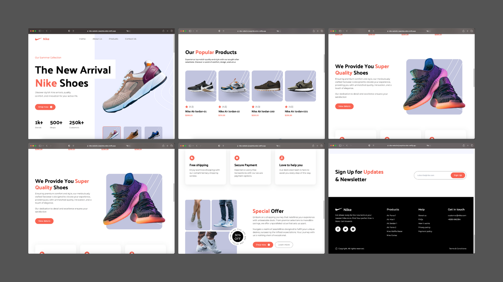

# Nike Website



Design Credits: Adrian Hajdin - JS Mastery
[View on Github](https://github.com/adrianhajdin/nike_landing_page)

## Description

"Explore Nike's innovative world through my concept website, blending Tailwind CSS, React, and Vite for a dynamic online experience."

## Getting Started

Follow the steps below to set up the project on your local machine and run it:

1. Clone the repository:

```bash
git clone https://github.com/JosephDoUrden/nike-website.git
cd nike-website/
npm run dev
```

## Contact

If you have any questions, feedback, or would like to connect, feel free to reach out to me.

- **Name:** Yusufhan Saçak
- **Email:** [yusufhan.sacak@bahcesehir.edu.tr](mailto:yusufhan.sacak@bahcesehir.edu.tr)
- **Website:** [yusufhan.dev](https://yusufhan.dev)
- **Twitter:** [@0xSCK](https://twitter.com/0xSCK)
- **LinkedIn:** [Yusufhan Saçak](https://www.linkedin.com/in/yusufhansacak/)

Feel free to contact me through any of the channels above. I'm open to collaborations and discussions related to Flutter development or any other projects.
